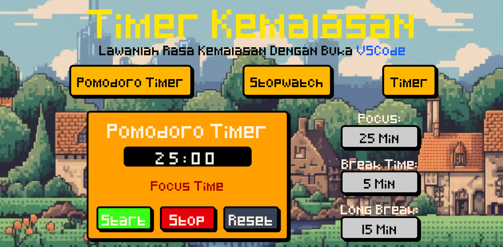
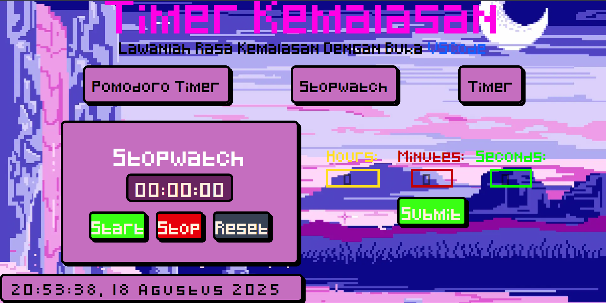
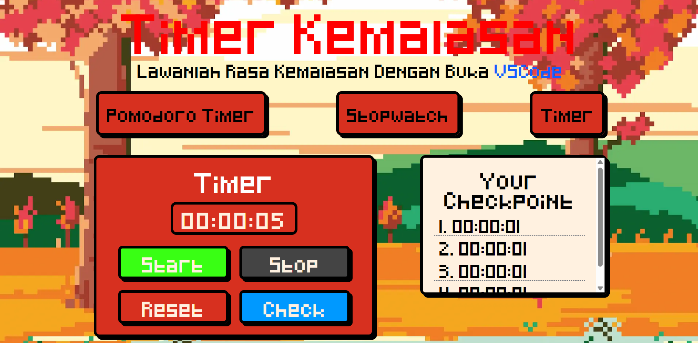

# Pixel Art Multi-Timer

A retro-styled, multi-function timer application designed to help you manage time for work, study, and personal projects. Built with vanilla JavaScript and styled with Tailwind CSS.

 
---

---
 
---

## ✨ Features

- **Three Timer Modes:** Easily switch between different timing methods.
  - **🍅 Pomodoro Timer:** A classic Pomodoro timer to boost productivity, featuring customizable focus, short break, and long break sessions.
  - **⏱️ Stopwatch:** A versatile countdown timer. Set a specific duration and get notified when the time is up.
  - **⏲️ Timer:** A standard count-up timer with a "Check" (lap) feature to record and display timestamps in the checkpoint list.

- **🎨 Dynamic Theming:** The background image and UI color accents change dynamically based on the active timer mode, creating a unique visual experience for each function.

- **📱 Responsive Design:** A fully functional and visually consistent layout for both desktop and mobile devices, featuring a swipe-able navigation menu on mobile.

- **👾 Custom Pixel Art Assets:** Utilizes a custom pixel font and retro-inspired visuals, including chunky borders and shadows, to create a nostalgic aesthetic.

- **🔔 Alert System:** A simple pop-up alert notifies you when a timer session is complete.

---

## 🛠️ Tech Stack

- **HTML5**
- **CSS3** (Styled with **Tailwind CSS v4**)
- **Vanilla JavaScript** (ES6+)
- **Node.js** & **npm** (for the development environment and build process)

---

## 🚀 Getting Started

Follow these instructions to get a copy of the project up and running on your local machine for development and testing purposes.

### Prerequisites

Make sure you have [Node.js](https://nodejs.org/) installed on your machine (which includes npm).

### Installation & Running

1.  **Clone the repository:**
    ```bash
    git clone https://github.com/hikmalrdtya/Timer.git
    ```

2.  **Navigate to the project directory:**
    ```bash
    cd your-repo-name
    ```

3.  **Install dependencies:**
    This will install Tailwind CSS and any other development tools.
    ```bash
    npm install
    ```

4.  **Run the development build process:**
    This command will start the Tailwind CLI in watch mode, which automatically recompiles your CSS file whenever you make changes.
    ```bash
    npm run dev
    ```

5.  **Open the application:**
    Open the `index.html` file in your browser. For the best development experience, it is recommended to use a live server extension, such as **Live Server** in VS Code.

---

## 🎨 Customization

The application's theme and core visual properties can be easily customized without a `tailwind.config.js` file, thanks to CSS Variables.

To change colors, fonts, or shadows, simply edit the variables defined at the top of the `src/css/input.css` file inside the `:root` block.

```css
/* src/css/input.css */

@layer base {
  :root {
    /* Define all your custom values here */
    --font-pixel-stack: 'pixel', "Segoe Ui", sans-serif, monospace;
    
    /* Color Palette */
    --color-yellow: #FFE600;
    --color-orange-light: #FFB600;
    /* ...etc. */

    /* Other Values */
    --shadow-chunky: 4px 4px 0px #000;
  }
}
